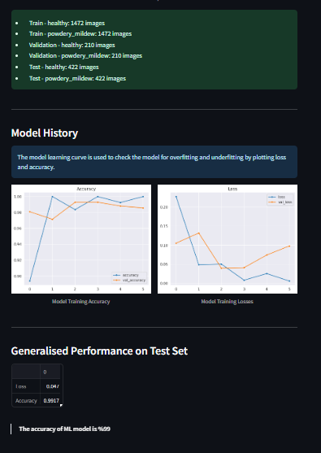

# **Mildew Detection in Cherry Leaves**

Using machine learning technology, the Mildew Detection app was developed for the fictional Farmy & Foods and lets users submit pictures of cherry leaves for examination. It can determine whether a cherry leaf is powdery mildew-infected or healthy, and it offers a report that can be downloaded that summarizes the results.

**Deployed version [Mildew Detection in Cherry Leaves](https://milestone-project-mildew-detection-in-cl6x.onrender.com)**

## Dataset Content

- We got the dataset from [Kaggle](https://www.kaggle.com/codeinstitute/cherry-leaves). Next, we came up with a fake user story that demonstrated how predictive analytics could be used in an actual project at work.

- There are about 4,000 photos in the dataset that were shot from the client's crop fields. A fungal disease that plagues many plant species, powdery mildew, is visible on both healthy and diseased cherry leaves in the pictures. One of the best goods in their portfolio is the cherry plantation crop, so the corporation is worried about offering the market a product of inferior quality.

## Business Requirements

Farmy & Foods' cherry plantations have been exhibiting powdery mildew, which is hindering their crop. Checking for powdery mildew on a particular cherry tree is now done by hand. An employee spends around half an hour in each tree, collecting a few leaf samples and visually confirming if the tree is healthy or has powdery mildew. Should powdery mildew be present, the staff member applies a certain substance to eradicate the mold. The application of this chemical takes one minute. Thousands of cherry trees owned by the corporation are spread over several farms around the nation. The time required for the manual process inspection makes this manual procedure unscalable.

The IT team proposed an ML system that uses an image of a leaf tree to instantaneously determine if it is healthy or has powdery mildew in order to save time in this procedure. There is a comparable manual method for identifying pests in other crops, and if this experiment is effective, it may be possible to expand it to all other crops. The dataset consists of a set of photos of cherry leaves that were collected from Farmy & Foods' farms.

- 1. The client wants to carry out a research to visually distinguish between a cherry leaf that has powdery mildew and one that is healthy.
- 2. The clients wants to know if the cherry leaf in the picture is healthy or if it has powdery mildew.

## Hypotheses and how to validate?

### ***Hypotheses***

- Healthy and powdery mildew-affected cherry leaves can be distinguished from one another using the obvious pattern differences between the two types of photos.

- Cherry leaves affected with powdery mildew differ from healthy leaves in subtle color and form.

- The given image dataset can be used to build a machine learning model that can determine with at least 97% accuracy if a leaf has powdery mildew.

### ***Validation***

- The image montage illustrates the apparent distinction between leaves that are healthy and those that have powdery mildew.

- Average, Difference, and Variability Color variations within the center of each leaf image supported the notion, but there aren't any obvious patterns that would allow one to distinguish them by shape.

- A performance evaluation of the ML pipeline reveals that it can distinguish between a healthy and diseased leaf with 99% accuracy.

## The rationale to map the business requirements to the Data Visualisations and ML tasks

### ***Business Requirement 1:***

The client wants to carry out a research to visually distinguish between a cherry leaf that has powdery mildew and one that is healthy.

> **Data Visualization**

- The dashboard will show mean and standard deviation photos of healthy and powdery mildew-infected cherry leaves.

- The difference between an average healthy leaf and an average powdery mildew-infected leaf will be demonstrated.

- An picture montage of healthy and powdery mildew-infected leaves will be shown.

### ***Business Requirement 2:***

The clients wants to know if the cherry leaf in the picture is healthy or if it has powdery mildew.

> **Classification**

- Build a binary classifier ML model to determine if a leaf is healthy or diseased with powdery mildew. 

- Evaluate the Ml model's loss and accuracy.

- Add an option for users to generate and download a prediction report for uploadable photos.

## Cross Industry Standard Process for Data Mining (CRISP-DM)

CRISP-DM was used while developing this project.

> Business Requirement 1

Study should include analysis on:

- average images and variability images for each class (healthy or powdery mildew),
- the differences between average healthy and average powdery mildew cherry leaves,
- an image montage for each class

> Business Requirement 2:

- deliver an ML system that is capable of predicting whether a cherry leaf is healthy or contains powdery mildew

***2. Data Understanding***

The [Kaggle dataset](https://www.kaggle.com/datasets/codeinstitute/cherry-leaves) is provided by Code Institute over 4k images of healthy and affected cherry leaves.

- Data collection.

- Retrieve data from the Kaggle dataset  and save as raw data.

***3. Data Preparation***

- Clean data, check and remove non image files
- Split data into train validation and test set
- Set Image shape
- Average and variability of images per label
- Load image shapes and labels in an array
- Plot and save mean variability of images per label
- Difference between average healthy and powdery mildew contained leaf
- Image montage
- Image data augmentation

***4. Modelling***

- Create CNN model
- Fit created ML model with train set
- Save model

***5. Evaluation***

- Plot model learning curve for model training loss and accuracy
- Evaluate model on test set
- Load random image to predict
- Convert image to array and prepare for prediction.
- Predict class probabilities and evaluate.

***6. Deployment***

- Deploy the models into production environment.

## ML Business Case

### Business Case Assessment

- What are the business requirements?

    The client is interested in performing a study to visually distinguish between a healthy cherry leaf and one with powdery mildew.

    The client wants to know if a cherry leaf is healthy or has powdery mildew.

- Is there any business requirement that can be answered via conventional data analysis?
    Yes, we can utilize traditional data analysis to run a study that visually distinguishes a healthy cherry leaf from one with powdery mildew.

- Does the client require a dashboard or API endpoint?

    The customer needs a dashboard.

- How does the client define a successful project outcome?

    A study demonstrating how to visually distinguish a healthy cherry leaf from one with powdery mildew.Additionally, the capacity to forecast whether a cherry leaf is healthy or includes powdery mildew.
- Can you divide the project into epics and user stories?

    1. Information collecting and data collection.
    2. Data visualization, cleanup, and preparation.
    3. Model training, optimization, and validation.
    4. Dashboard planning, design, and development.
    5. Dashboard deployment and release.

- Ethical or Privacy concerns?

    The client provided the data under an NDA (non-disclosure agreement), therefore the data should only be shared with professionals that are officially involved in the project.

- Does the data suggest a particular model?

    The data suggests a binary classifier, indicating whether a particular cherry leaf is healthy or contains powdery mildew.

- What are the model's inputs and intended outputs?

    The input is a cherry leaf image and the output is a prediction of whether the cherry leaf is healthy or contains powdery mildew.

- What are the criteria for the performance goal of the predictions?

    We agreed with the client a degree of 97% accuracy.

- How will the client benefit?

    The client will not supply the market with a product of compromised quality.

---

### ***Actions to fulfill the business case***

> Using the dataset of images provided by client, build a supervised, binary classification ML model to predict if a leaf is healthy or infected with powdery mildew.

- **Data Collection:**

    Collect a image dataset of  healthy and powdery mildew-infected leaves.
- **Data Preprocessing:**

    Clean the non image files, check avarage image size, and split the data to train, validation and test sets.
- **Feature Extraction:**

    Use CNN to pull significant features from the images.
- **Model Selection:**

    Use CNN-based machine learning model for binary classification.
- **Model Training:**

    Train the model using the training set, and validate model performance with the validation set.
- **Model Evaluation:**

    Evaluate the trained model's performance with model learning curve and the validation set.
- **Model Testing:**

    Test the model's performance with different test datasets to evaluate its abstraction capability.

- **Deployment:**

    Deploy the trained model into production and incorporate it into an application where users can upload leaf images, get predictions, and download prediction reports.

---

### ***Model details***

- CNN model is used for image processing and designed for binary image classification.
- Sequential model arranges a sequence of layers in  neural network.
- Model has 4 convolutional layers and a dense layer with 128 neurons.
- Dropout layer and earlystopping is used to reduce the chance of overfitting the neural network.
- The output layer has one neuron with a sigmoid as the activation function.
- The loss function used is binary_crossentropy because it is a binary classification.
- The optimizer used is adam.

## Dashboard Design

1. ***Navigation***

- The navigation bar is accessible across all dashboard pages and is easy to use.

    

    
Navigation Image

    

    

---

2. ***Page 1: Project Summary***

- Farmy & Foods Logo - Image
- Project Summary - block of information
- Project Dataset - block of information
- Bussines requirements - block of information
- Link to the README file - block of information & hyperlink

    

    
Project Summary Page Image

    

    

---

3. ***Page 2: Leaf Visualizer***

- Business Requirement 1 - block of information

- Checkbox1 - Difference between average and variability image
    - A quick explanation of the data visualization result - block of information
    - Applicable image - image

- Checkbox2 - Differences between the average image of healthy and powdery mildew infected leaves

    - A quick explanation of the data visualization result - block of information
    - Another explanation of the data visualization result - block of information
    - Applicable image - image

- Checkbox3 - Image montage

    - Instruction for the user to click the "Create Montage" button - block of information
    - Image montage explanation - block of information
    - Select box - where the user can choose a label to create a montage
    - Create Montage button
    - The image montage of the selected label

        

        
Leaf Visualizer Page Image

        

        

        

        

---

4. ***Page 3: Powdery Mildew Detector***

- Business Requirement 2 - block of information
- Horizontal line
- Live prediction info and hyperlink to the download images of cherry leaves - block of information
- File uploader for users to upload cherry leaf images for  a diagnosis
    - Image Name - information block
    - Uploaded leaf sample - image
    - Diagnosis on the leaf sample - block of information
    - The diagnosis probability - barplot
    - Analysis report table for all uploaded images - data frame
    - Download report link

    

    
Powdery Mildew Detector Page Image

    

    

    

---

5. ***Page 4: Project Hypotheses and Validation***

- Powdery Mildew disease detailed explanation - block of information
- Horizontal line
- Hypotheses - block of information
- Validation - block of information
- Horizontal line
- Business Requirements - Text

    

    
Project Hypotheses and Validation Page Image

    

    

---

6. ***Page 5: ML Performance Metrics***

- Average Image size in dataset - image
- Average Image size in dataset - block of information
- Horizontal line
- Train, Validation and Test Set: Label Frequencies plot - image
- Train, Validation and Test Set: Label Frequencies - block of information
- Model History -  block of information
- Model History: Accuracy and Loss Line Graph - image
- Generalised Performance on Test Set - loss and accuracy performance metrics
- Model accuracy percentage - Text

    

    
ML Performance Metrics Image

    

    

    

---

## Unfixed Bugs

- Unable to deploy in Heroku due to slug size concern. Deploy the project in Render without bugs.

### Render

- The App live link is: https://milestone-project-mildew-detection-in-cl6x.onrender.com
- The project was deployed to Heroku using the following steps.

1. Log in to Render.com  and create an App by hiting New.
2. Navigate to Web Service.
3. Connect to Github repository.
4. At the Deploy tab, select GitHub as the deployment method.
5. Fill-in Build Command and Start Command with  pip install -r requirements.txt && ./setup.sh and  streamlit run app.py respectively.
6. Add two Environment Variable with key: PORT and a value: 8501 and key: PYTHON_VERSION and value: 3.12.8
7. Select Manual deployment as my personal preference.
8. The deployment process should happen smoothly if all deployment files are fully functional. Click the link to Open App on the top of the page to access your App.

### Forking the Repository

- To create a copy of the repository, follow below steps:

1. Go the repository you want to fork.
2. Click the 'Fork' button located at the top right corner of the page.

### Cloning the Repository

- To clone the repository to your local machine, proceed as follows:

1. Go the repository you want to clone.
2. Click the green '<> Code' button and select your preferred cloning option from the list. Copy the provided link.
3. Open your terminal and navigate to the directory where you want to store the cloned repository.
4. Execute the command 'git clone' followed by the URL you copied earlier.
5. Press 'Enter' to create a local clone of the repository.

## Main Data Analysis and Machine Learning Libraries

### Languages

- Python

### Frameworks, Libraries & Programs Used

#### Numpy

- [NumPy](https://numpy.org/) was used for converting images into arrays to be fed to ML models. It is an open-source Python library used for working with arrays, matrices, and high-level mathematical functions.

#### Pandas

- [Pandas](https://pandas.pydata.org/) was used to manipulate and analyze the data. Pandas is a data manipulation and analysis library for Python, offering data structures and operations for manipulating numerical tables and time series data.

#### Matplotlib

- [Matplotlib](https://matplotlib.org/) was used to create charts and plots to visualize the data. It is a cross-platform, data visualization and graphical plotting library for Python.

#### Seaborn

- [Seaborn](https://seaborn.pydata.org/) was used for data visualization, built on top of Matplotlib, with additional high-level interfaces for drawing attractive and informative statistical graphics.

#### Plotly

- [Plotly](https://plotly.com/) was used to create interactive charts and plots. Plotly is a versatile graphing library that supports various chart types and provides interactivity features such as hover tooltips, zooming, and panning.

#### Streamlit

- [Streamlit](https://streamlit.io/) was used to create the project dashboard. It is an open-source app framework for building and sharing data-driven web applications quickly.

#### Scikit-learn

- [Scikit-learn](https://scikit-learn.org/stable/) was used as a base machine-learning library for the project. It is a powerful and easy-to-use library for machine learning in Python, offering tools for data preprocessing, feature extraction, model selection, and evaluation. It provided a consistent interface for implementing various machine learning algorithms and pipelines, facilitating the development and assessment of predictive models.

#### Tensorflow

- [Tensorflow](https://www.tensorflow.org/) was additional important ML library used for the project. It is an open-source deep learning framework developed by Google, offers comprehensive support for building and deploying machine learning models at scale. It provides low-level APIs for neural network development as well as high-level APIs through its Keras interface, enables to build and train complex neural network models efficiently.

#### Keras

- [Keras](https://keras.io/) was used as a high-level API for building neural networks for the project. It is a high-level, deep-learning API developed by Google for implementing neural networks. It maks the implementation of neural networks effortless and supports multiple backend neural network computations.

#### PIL

- [PIL](https://pypi.org/project/pillow/): Python Imaging Library is a free and open-source additional library for the Python programming language that adds support for opening, manipulating, and saving many different image file formats.

#### GitHub

- [GitHub](https://github.com/) was used as an online software development platform. It's used for storing, tracking, and collaborating on software projects.

#### Gitpod

- [Gitpod](https://www.gitpod.io/) was used as workspace environment for the project. It is a platform for automated and standardized development environments.

#### Kaggle

- [Kaggle](https://www.kaggle.com/): Kaggle was used as the primary source of image dataset.Kaggle is a data science competition platform and online community for data scientists and machine learning practitioners under Google LLC. It enables data scientists and other developers to engage in running machine learning contests, write and share code, and to host datasets.

#### Render

- [Render](https://dashboard.render.com/): Render was used to deploy the web application for the project. It is a cloud platform that lets companies build, deliver, monitor and scale apps.

## Credits

### Content

- The Malaria Detector project code has been used as the study and reference material - [Malaria Detector](https://learn.codeinstitute.net/courses/course-v1:code_institute+CI_DA_ML+2021_Q4/courseware/07a3964f7a72407ea3e073542a2955bd/29ae4b4c67ed45a8a97bb9f4dcfa714b/).

- The Churnometer project provided by Code Institute has been the code that was used to learn the concepts used in this project. -
[Churnometer](https://learn.codeinstitute.net/courses/course-v1:CodeInstitute+DDA101+2021_T4/courseware/bba260bd5cc14e998b0d7e9b305d50ec/c83c55ea9f6c4e11969591e1b99c6c35/).

- Use SerraKD [Readme](https://github.com/SerraKD/mildew-detection/blob/main/README.md?plain=1) file and powdery mildew information as reference.

- [ChatGPT](https://chatgpt.com/) for troubleshooting and acquiring further information.

## Acknowledgements

- Code Institute Slack Channel

